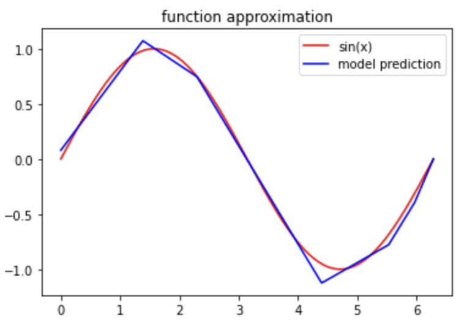
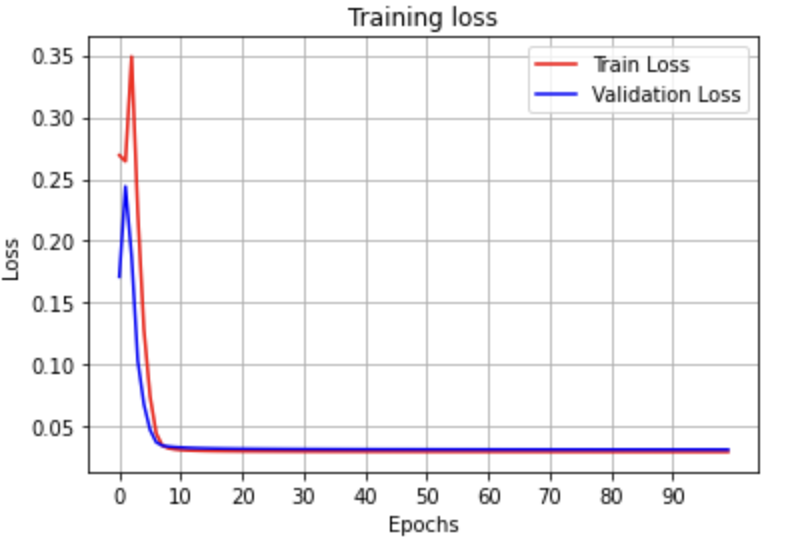
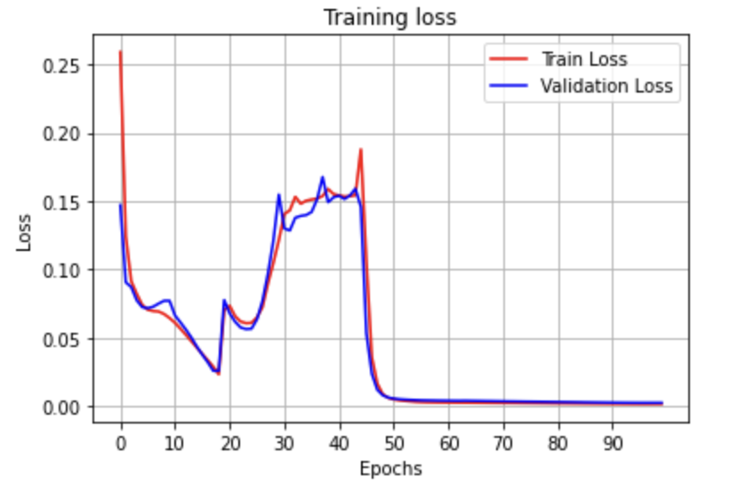

# Neural Network with Gradient Descent from Scratch
This project is a simple implementation of a neural network with gradient descent optimization from scratch. The goal of this project is to demonstrate how a neural network works and how the gradient descent algorithm can be used to optimize its parameters.
## Dependencies

The code is written in Python 3 and requires the following packages:

- NumPy
- Matplotlib

You can install these packages using pip:
``` bash
pip install numpy matplotlib
```

## Getting Started
To get started with the project, clone this repository to your local machine and navigate to the directory:

``` bash
git clone https://github.com/username/Neural-Network-Gradient-Descent-From-Scratch.git
cd Neural-Network-Gradient-Descent-From-Scratch
```
Then, open the `Neural-Network-Gradient-Descent-From-Scratch.ipynb` file in Jupyter Notebook or Jupyter Lab. You can run the code cells in the notebook to train and test the neural network.

## Dataset
The dataset used in this project is generated using the following function:
``` python
def f(x1, x2):
  y = np.sin(x1+x2)
  return y
```
The dataset consists of 10,000 samples, each with two input features and one target value.

## Model Architecture

The neural network consists of an input layer with two neurons, a hidden layer with a user-defined number of neurons, and an output layer with one neuron. The activation function used in the hidden layer is the Rectified Linear Unit (ReLU) function, and the output layer has no activation function.
The neural network is implemented as a class in the `NeuralNetwork` module. The class has the following methods:
- `__init__(self, lr, numOfHLNeurons)`: Initializes the neural network with a learning rate `lr` and a number of neurons in the hidden layer `numOfHLNeurons`.
- `feedForward(self)`: Computes the output of the neural network for a given input.
- `backProp(self, y)`: Computes the gradients of the loss function with respect to the parameters of the neural network using backpropagation.
- `calCost(self, y, yhat)`: Computes the mean squared error between the target value `y` and the predicted value `yhat`.
- `relu(self, x)`: Computes the ReLU activation function for a given input `x`.
- `d_relu(self, x)`: Computes the derivative of the ReLU activation function for a given input `x`.
- `train(self, x, y, x_valid, y_valid, epochs)`: Trains the neural network using gradient descent optimization for a given number of epochs.

## Training and Testing
The dataset is split into three sets: a training set with 80% of the data, a validation set with 10% of the data, and a test set with the remaining 10% of the data. The input features in each set are normalized to have zero mean and unit variance.

The neural network is trained on the training set using gradient descent optimization. The validation set is used to monitor the performance of the neural network during training and to avoid overfitting. The test set is used to evaluate the performance of the trained neural network.

After training, the performance of the neural network is evaluated on the test set using the mean squared error between the target values and the predicted values.

  

## Acknowledgments
1. [Neural Networks and Deep Learning" by Michael Nielsen](http://neuralnetworksanddeeplearning.com/index.html)- This is an online book that provides an introduction to neural networks and deep learning. It covers the theory behind neural networks, as well as practical implementation details.
2. [Deep Learning with Python" by François Chollet](https://www.manning.com/books/deep-learning-with-python) - This book provides a hands-on introduction to deep learning using the Keras library. It covers the basics of neural networks, as well as more advanced topics like convolutional and recurrent neural networks.
3. [Backpropagation in neural networks by Wikipedia](https://en.wikipedia.org/wiki/Backpropagation) - This article provides an overview of backpropagation, the algorithm used to train neural networks. It covers the theory behind backpropagation, as well as practical implementation details.
4. [Gradient descent" by Wikipedia](https://en.wikipedia.org/wiki/Gradient_descent) - This article provides an overview of gradient descent, the optimization algorithm used to minimize the loss function in neural networks. It covers the theory behind gradient descent, as well as practical implementation details.
